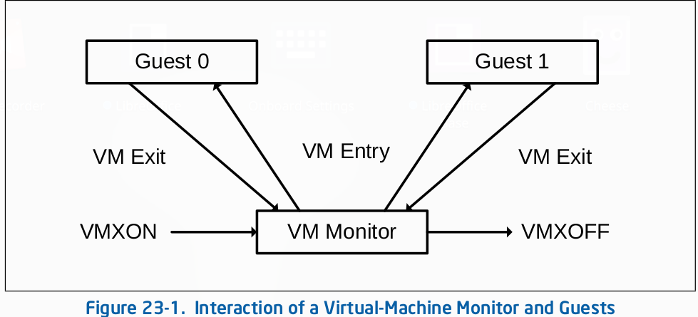

### Minimal Hypervisor
This is a minimal Hypervisior for linux OS written from Scratch. 
### Steps to write a hypervisor
    Enter VMX mode using VMXON to enable virtualization.
    Clear the guest's Virtual Machine Control Structure (VMCS) using VMCLEAR.
    Load the guest pointer using VMPTRLD to set the VMCS for the guest.
    Write VMCS parameters using VMWRITE to configure virtualization settings.
    Launch the guest using VMLAUNCH to start its execution.
    Handle guest exit events, such as VMCALL instructions or other triggers.
    Read guest-exit information using VMREAD to gather exit details.
    Optionally reenter the guest using VMRESUME to continue its execution.
    Eventually, leave VMX mode using VMXOFF to deactivate virtualization.

Image source: [Intel Manual](https://www.intel.com/content/www/us/en/developer/articles/technical/intel-sdm.html)

### Instructions

Refer to instructions.md to compile and run the hypervisor

### Glossary

    VMXON: VMXON is an instruction that initializes VMX (Virtual Machine Extensions) and enables the processor's virtualization support.
    VMCS: VMCS stands for Virtual Machine Control Structure, a data structure used to configure and manage the behavior of a virtual machine.
    VMCLEAR: VMCLEAR is an instruction used to clear the contents of a specific VMCS, preparing it for reconfiguration.
    VMPTRLD: VMPTRLD is an instruction that loads a pointer to a VMCS, allowing the processor to operate in the context of a specific virtual machine.
    VMWRITE: VMWRITE is used to write values into specific fields within the currently active VMCS.
    VMLAUNCH: VMLAUNCH is an instruction that starts the execution of a virtual machine, transitioning from the host to the guest.
    VMCALL: VMCALL is a guest instruction used for communication between the guest and the VMM (Virtual Machine Monitor).
    VMREAD: VMREAD is used to read values from specific fields within the currently active VMCS.
    VMRESUME: VMRESUME is an instruction used to resume the execution of a virtual machine after a guest exit.
    VMXOFF: VMXOFF is an instruction used to disable VMX and exit VMX operation, returning control to the host operating system.